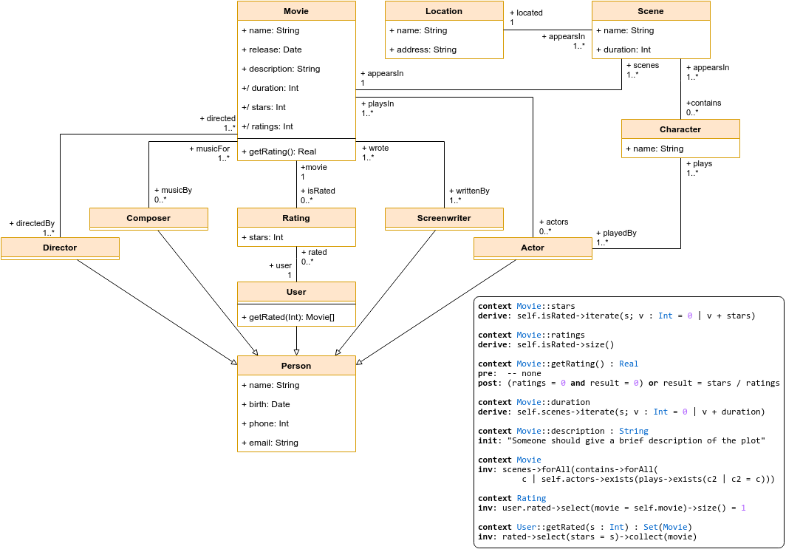

# UML and OCL: movie model

## Assignment

topic: models in UML and OCL

deadline: null

### Exercise 1

- create a conceptual UML class diagram for the movie domain
  - movies
  - directors, writers
  - cast (actors and their characters)
  - scenes and filming locations
- At least 5 classes and 10 properties

### Exercise 2

- Write at least 5 integrity constraints for your UML class diagram in OCL
- At least 1 invariant
- At least 1 pre-condition
- At least 1 post-condition
- At least 1 default value definition
- At least once used select or reject
- At least once used forAll or exists
- At least once used size

## Solution

### Inspiration

Řešení je inspirováno běžnými filmovými databázemi.

### Model

### Decisions

V tomto řešení jsou implementovány všechny zadané třídy a jejich intuitivní vztahy.

U všech zadaných lidských entit bylo rozhodnuto, že budou derivovat třídu `Person`, která definuje jejich základní parametry, jejich vztahy se třídou `Movie` jsou potom přímé a pojmenované přesně podle daného vztahu mezi nimi.

Mimo zadané lidské entity je přidána třída `Composer`, která říká, že hudba pro daný film byla složena daným umělcem.

Třída `Character` nemá přímý vztah se třídou `Movie`, ale se třídou `Scene` podle toho, jestli daná postava vystupuje v dané scéně. Dále má vztah s třídou `Actor`, který popisuje, že je hrána daným hercem.

`Scene` má mimo vztahu se třídou `Character` ještě vztah se třídou `Movie`, který říká, že se vyskytuje v daném filmu (nemá cenu předpokládat, že by se vyskytovala ve více filmech); a vztah se třídou `Location`, který říká, že se daná scéna vyskytuje v dané lokaci.

`Scene` může být propojena s nulovým počtem `Character`, to nastává například u záběrů na krajinu.

Model je rozšířen o třídu `User`, ta reprezentuje člověka přistupujícího k informacím reprezentovaným tímto modelem. Uživatel může hodnotit nějaký film určitým počtem hvězd (konkrétní počet určí implementace - toto dokáže reprezentovat například tzv. *lajky* či běžný systém hodnocení 1 až 5 hvězdami). Tento fakt model zachycuje třídou `Rating`, která zachycuje právě jedno takové hodnocení (unikátní pro danou dvojici `(Movie, User)`).

`Movie` má mimo již zmíněných vztahů očekávatelné parametry a metodu `getRating()`, která vrátí průměrné hodnocení (podobně jako u běžných filmových databázích). `User` pak má metodu `getRated(Int)`, která může sloužit pro vypsání filmů, které se uživateli líbily - to může být zajímavé pro doporučovací algoritmy.
